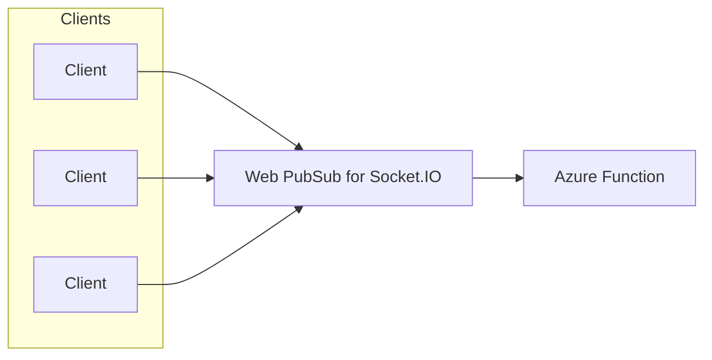

# Announcing Serverless Support in Web PubSub for Socket.IO

We are excited to announce the public preview of **Socket.IO Serverless Mode** in Azure Web PubSub, a new opportunity for developers looking to build real-time applications with Socket.IO but without the hassle of managing persistent connections in servers. This new serverless mode allows Socket.IO to be hosted in Azure Function with a stateless, scalable environment, simplifying the development of real-time features while reducing costs and maintenance overhead.

## What is Socket.IO Serverless Mode?

Traditionally, Socket.IO requires a persistent server to manage client connections and communications. However, with the rise of serverless computing, developers are seeking more flexible solutions that eliminate server management. Socket.IO Serverless Mode allows you to leverage serverless architecture while still maintaining real-time, bidirectional communication between clients and the server.

In this new mode, Socket.IO servers become stateless, handling communication logic via RESTful APIs and webhooks. Clients still use persistent connections, but the service help you to maintain the client connections and the backend logic can run as Azure Functions, significantly simplifying deployment and scaling. This capability is not natively supported by Socket.IO, but is made possible by the Web PubSub for Socket.IO service.

Here is a common architecture with Socket.IO Serverless Mode:

// Insert architecture diagram here

## Differences Between Default Mode and Serverless Mode

| Feature | Default Mode | Serverless Mode |
|------------|------------|------------|
|Architecture|Persistent connections for both clients and servers.| Clients use persistent connections but servers use RESTful APIs and webhook event handlers in a stateless manner.|
| Azure Function compatibility| No | Yes |
|SDKs and Languages|Requires the official JavaScript server SDKs together with [Extension library for Web PubSub for Socket.IO SDK](https://www.npmjs.com/package/@azure/web-pubsub-socket.io); All compatible clients|No mandatory SDKs or languages. Use [Socket.IO Function binding](https://www.nuget.org/packages/Microsoft.Azure.WebJobs.Extensions.WebPubSubForSocketIO) to simplified integrate with Azure Function; All compatible clients|
|Network Accessibility| Servers do not need to expose network access as it proactively makes connection to the service|Servers must expose network access to the service for webhook calls|
|Feature supports|Most features are supported, with some exceptions: [Unsupported server APIs of Socket.IO](./socketio-supported-server-apis.md)|Most common features are supported: [Supported functionality and RESTful APIs](./socket-io-serverless-protocol.md#supported-functionality-and-restful-apis)|

## Getting Started with Socket.IO Serverless Mode

Socket.IO Serverless Mode is ideal for scenarios that require lightweight, event-driven communication without the need for persistent backend connections. One of the best starting points is broadcasting messages to Socket.IO clients. Scenarios such as live sports scores, financial tickers, or real-time dashboards can benefit greatly from the scalability and cost efficiency that serverless architecture offers.

To get started, follow our [Publish messages tutorial](https://learn.microsoft.com/azure/azure-web-pubsub/socket-io-serverless-tutorial-python) and learn how to build a real-time stock index application with Python and Azure Functions.

In addition to broadcasting, bidirectional real-time communication between clients and servers remains a key feature of Socket.IO.  If you're looking to build a chat application, check out our [Build chat app tutorial](https://learn.microsoft.com/azure/azure-web-pubsub/socket-io-serverless-tutorial-javascript) for a step-by-step guide to implementing chat functionality with Socket.IO Serverless Mode.

For a quick hands-on experience, visit our [QuickStart](https://learn.microsoft.com/azure/azure-web-pubsub/socket-io-serverless-quickstart) to see how to build and deploy a chat application online with Socket.IO Serverless Mode, featuring fully identity-based authentication.
